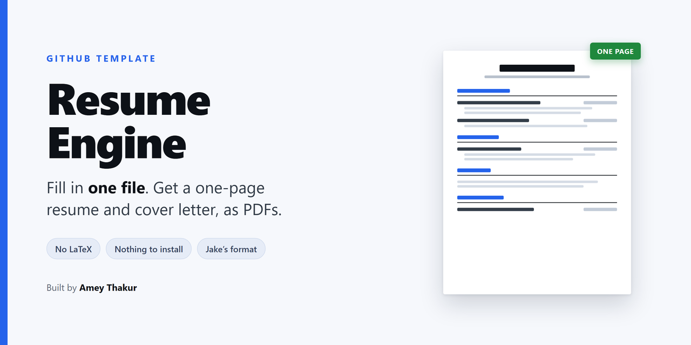
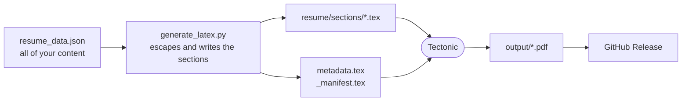

<div align="center">

<br>

# Resume Template

**Edit one JSON file. The resume and the cover letter build themselves.**

<br>

A LaTeX resume and cover letter where the content lives in a single JSON file
and no one has to touch the typesetting. A pre-processor writes the LaTeX, and
Tectonic compiles the PDFs. Push to `main` and GitHub Actions publishes them as
a release.

<br>

[How it works](#how-it-works) &nbsp;·&nbsp;
[The data file](#the-data-file) &nbsp;·&nbsp;
[For AI agents](#for-ai-agents) &nbsp;·&nbsp;
[Set it up](#set-it-up)

<br>

[](https://github.com/Amey-Thakur/RESUME-TEMPLATE/releases/latest/download/resume.pdf)
&nbsp;
[](https://github.com/Amey-Thakur/RESUME-TEMPLATE/releases/latest/download/cover_letter.pdf)

<br>

[](LICENSE)
[](https://github.com/Amey-Thakur/RESUME-TEMPLATE/actions/workflows/build.yml)
[](https://tectonic-typesetting.github.io)
[](https://github.com/Amey-Thakur/RESUME-TEMPLATE/generate)
[](https://github.com/Amey-Thakur)

<br>



</div>

---

<br>

## How it works



Four properties follow from that shape, and each one is the reason a piece of
this exists.

**Content never touches LaTeX.** You write plain text. The pre-processor escapes
every reserved character, so an ampersand in a company name or a percentage in a
bullet cannot break the build.

**Sections are optional.** `section_order` in the JSON decides which sections
appear and in what order. Leave `publications` out of that list and the heading
does not exist in the PDF. No empty sections, no editing the document to remove
one.

**The output is machine readable.** `\pdfgentounicode=1` and T1 encoding mean the
text layer of the PDF copies and parses correctly, which is what an applicant
tracking system reads.

**One pre-processor, not two.** The shell script, the PowerShell script and CI
all call the same Python file, so the escaping rules cannot drift apart.

<br>

## The format

One page, one column, no graphics. This is the dense single-column layout that
[r/EngineeringResumes](https://www.reddit.com/r/EngineeringResumes/wiki/) treats
as its default recommendation, popularised by Jake Gutierrez's LaTeX template,
and it is the safest choice for engineering applications: standard section
names, a wide text block that fits an internship history and several projects on
one page, and a text layer that parses cleanly through an applicant tracking
system.

The resume is 10pt with 0.5in margins. The cover letter keeps the airier
setting, because it is prose rather than a scan. Both are one page.

[`resume.sty`](resume/templates/resume.sty) is a layout, not a second pipeline.
It loads [`base.sty`](resume/templates/base.sty) and overrides only the margins,
the leading, the heading spacing, the list spacing and the header. Every entry
macro keeps its name and its argument order, because that is the contract the
pre-processor writes against.

> **Fit the content to the page, not the page to the content.** The build fails
> if either document runs past one page. Shrinking the font to win half a line
> is the wrong fix and reads as one: cut the oldest role, or cut the weakest
> bullet.

<br>

## The data file

One file holds everything: contact details, every section of the resume, and
the cover letter. Each field is a bracketed placeholder such as `[FULL_NAME]`,
and the `_instructions` block at the top carries the rules for filling them in.
[Set it up](#set-it-up) walks through it command by command.

Two rules decide whether the result is any good.

> [!TIP]
> Write a plain `|` when you want a separator. The pre-processor typesets it.
> Never write LaTeX in the JSON: `&`, `%`, `_`, `#`, `$`, `{`, `}`, `~`, `^` and
> `\` are all escaped for you.

> [!IMPORTANT]
> Bullets are scored on evidence, not duties. The template asks for
> **accomplished X, as measured by Y, by doing Z**. A bullet with no number in
> it describes a job description rather than your work, and it is the first
> thing a reviewer discounts.

<br>

## For AI agents

This repository is built to be filled in by an agent without further
instruction. The content model is one JSON file, and it carries its own
directions in an `_instructions` block that the pre-processor ignores.

1. Read `resume/configuration/resume_data.template.json`.
2. Replace every `[BRACKETED_PLACEHOLDER]` with real content, following the
   `bullets` rule in `_instructions`.
3. Delete any section you cannot fill honestly, and remove its name from
   `section_order`.
4. Write the result to `resume/configuration/resume_data.json`.
5. Run `python scripts/generate_latex.py --check`. It exits non-zero and lists
   what is left while any placeholder remains.
6. Build with `scripts/build.sh` or `scripts/build.ps1`.

The pre-processor handles escaping, separator typesetting, section ordering and
omission, and the PDF filename. There is nothing else to decide.

<br>

## Set it up

From nothing to a compiled PDF. Every block is one command, so each is a single
copy. Where macOS, Linux and Windows differ, both are given.

### 1. Get the files

Press **Use this template** at the top of this page for your own copy, or clone
this one. Identical on every platform.

```bash
git clone https://github.com/Amey-Thakur/RESUME-TEMPLATE.git
```

```bash
cd RESUME-TEMPLATE
```

### 2. Check Python

Version 3.8 or newer. Nothing else needs installing, because the pre-processor
uses only the standard library.

**macOS and Linux**

```bash
python3 --version
```

**Windows (PowerShell)**

```powershell
py --version
```

If it is missing, take it from [python.org](https://www.python.org/downloads/).
On Windows, tick **Add python.exe to PATH** in the installer.

### 3. Install Tectonic

Tectonic is the compiler. It is a single binary that fetches the TeX packages it
needs by itself, so there is no TeX Live to install.

**macOS and Linux**, with Homebrew:

```bash
brew install tectonic
```

**Windows (PowerShell)**, the official installer, which drops the binary in the
current directory:

```powershell
iex ((New-Object System.Net.WebClient).DownloadString('https://drop-ps1.fullyjustified.net'))
```

**Any platform**, if you already use Conda or Rust:

```bash
conda install -c conda-forge tectonic
```

```bash
cargo install tectonic
```

Prebuilt binaries for every platform are on
[the releases page](https://github.com/tectonic-typesetting/tectonic/releases)
if you would rather unpack one yourself and put it on your `PATH`. Then check
it, the same command everywhere:

```bash
tectonic --version
```

### 4. Make your own data file

**macOS and Linux**

```bash
cp resume/configuration/resume_data.template.json resume/configuration/resume_data.json
```

**Windows (PowerShell)**

```powershell
Copy-Item resume/configuration/resume_data.template.json resume/configuration/resume_data.json
```

This copy is gitignored, so your details never reach a public repository.

### 5. Fill it in

Open `resume/configuration/resume_data.json` and replace every
`[PLACEHOLDER]`. The `_instructions` block at the top of the file says how to
write the bullets and how to drop a section you do not need.

### 6. Check nothing was missed

Exits non-zero and lists what is left while any placeholder remains.

**macOS and Linux**

```bash
python3 scripts/generate_latex.py --check
```

**Windows (PowerShell)**

```powershell
py scripts/generate_latex.py --check
```

### 7. Build

**macOS and Linux**

```bash
./scripts/build.sh
```

**Windows (PowerShell)**

```powershell
powershell -ExecutionPolicy Bypass -File scripts/build.ps1
```

The PDFs land in `output/`, named after you.

```bash
ls output
```

<br>

### Working offline

Only step 3 and the first build need a network. Tectonic caches every package
it downloads, so once one build has finished the whole pipeline runs with no
connection. To prove it, and to make a missing package an error rather than a
silent download, run this. The same command everywhere:

```bash
tectonic --only-cached resume/source/resume.tex --outdir output
```

> [!TIP]
> Regenerating the LaTeX without compiling is useful while you are editing the
> JSON and want to see what it produces.
>
> **macOS and Linux**
>
> ```bash
> python3 scripts/generate_latex.py
> ```
>
> **Windows (PowerShell)**
>
> ```powershell
> py scripts/generate_latex.py
> ```

<br>

## What CI does

On every push to `main`, the workflow runs the same pre-processor, compiles both
documents with Tectonic, uploads the PDFs as artefacts for 90 days, and replaces
the `latest` release with the new files.

> [!NOTE]
> With no `resume_data.json` present the build uses the template, so the
> published release is the empty form with its placeholders visible. That is
> the structure you get, not anyone's resume. While the name is still a
> placeholder the files are published as `resume.pdf` and `cover_letter.pdf`,
> so a fork never advertises a release for someone who does not exist.

<br>

## What is where

| Path | What it holds |
| :--- | :--- |
| [resume/configuration/](resume/configuration/) | [`resume_data.template.json`](resume/configuration/resume_data.template.json), the only file you edit |
| [resume/templates/](resume/templates/) | [`base.sty`](resume/templates/base.sty) with the shared layout, plus a thin style for each document |
| [resume/source/](resume/source/) | `resume.tex`, the entry point. The cover letter is generated |
| [scripts/](scripts/) | [`generate_latex.py`](scripts/generate_latex.py), the pre-processor, and the two build wrappers |
| [.github/workflows/](.github/workflows/) | Compile and publish |

Rebuilt on every run and gitignored: `resume_data.json`, `metadata.tex`,
`resume/sections/`, `resume/source/cover_letter.tex`, `output/`.

<br>

## Design decisions

| Decision | Why |
| :--- | :--- |
| Content in JSON | Separates data from typesetting, and is safe for a program to edit |
| Bracketed placeholders | Unambiguous, and greppable, so unfilled fields can be detected rather than shipped |
| A single Python pre-processor | Two implementations of the escaping rules drifted, and a separator bug survived in one of them |
| Character-by-character escaping | A substitution cannot be re-processed by a later rule, which is what produced malformed output before |
| `titlesec` and `enumitem` spacing | Declarative spacing holds as content grows. Negative `\vspace` corrections overlap once a section gets dense |
| Shared `base.sty` | The resume and the cover letter cannot drift apart |
| `\pdfgentounicode=1`, T1 | The PDF text layer stays selectable, searchable and parseable |
| Tectonic | Self-contained, fetches packages on demand, no TeX Live |
| `resume_data.json` gitignored | Personal details never reach a public fork |

<br>

---

<div align="center">

Prepared by **[Amey Thakur](https://github.com/Amey-Thakur)** &nbsp;·&nbsp;
ORCID [0000-0001-5644-1575](https://orcid.org/0000-0001-5644-1575)

<sub>Released under the <a href="LICENSE">MIT License</a>, with citation metadata in <a href="CITATION.cff">CITATION.cff</a>.<br>
Use it, fork it, and make it yours.</sub>

</div>
