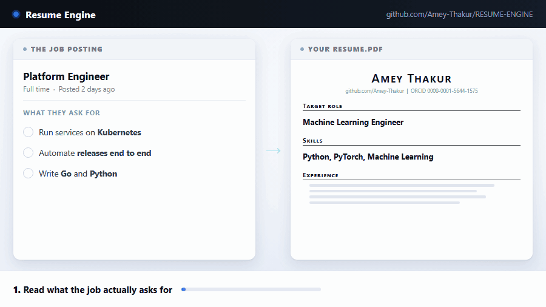
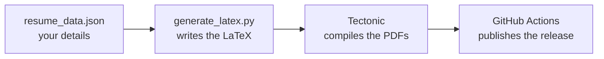

<div align="center">

<br>

# Resume Engine

**Fill in one file. Get a one-page resume and a matching cover letter, as PDFs.**

<br>

No LaTeX. No software to install. No formatting.
You edit your details in the browser, and GitHub builds both documents for you.

<br>

[](LICENSE)
[](https://github.com/Amey-Thakur/RESUME-ENGINE/actions/workflows/build.yml)
[](https://tectonic-typesetting.github.io)
[](https://github.com/Amey-Thakur/RESUME-ENGINE/generate)
[](https://github.com/Amey-Thakur/RESUME-ENGINE/commits/main)
[](https://github.com/Amey-Thakur)

<br>

**[Use this template](https://github.com/Amey-Thakur/RESUME-ENGINE/generate)** &nbsp;·&nbsp;
[See a resume it built](https://github.com/Amey-Thakur/RESUME-ENGINE/releases/latest) &nbsp;·&nbsp;
[See the cover letter](https://github.com/Amey-Thakur/RESUME-ENGINE/releases/latest)

<br>



</div>

---

<br>

## Start here

Four steps. All of them in your browser. Nothing to install.

**1. Press [Use this template](https://github.com/Amey-Thakur/RESUME-ENGINE/generate)** and give your new repository a name.

**2. Open `resume/configuration/resume_data.json`** and press the pencil icon to edit it.

**3. Replace the example details with your own**, then press **Commit changes**.

**4. Wait about two minutes, then open the Releases page** on the right of your repository. Your resume and cover letter are there as PDFs.

That is the whole loop. Every time you change the file, both PDFs are rebuilt.

<br>

> [!TIP]
> Change one line, get a new PDF. That is what makes this worth having: when a
> job asks for something specific, you edit two bullets and download a version
> of your resume aimed at that job, instead of hunting for last year's Word file.

<br>

---

<br>

## What you get

| What you get | What it is |
|---|---|
| **A resume** | One page. Never two, because the build refuses to publish two. |
| **A cover letter** | One page, in matching type, from the same file. |
| **Real PDFs** | Text you can select and search, not a picture of a page. |
| **A permanent link** | Your latest PDFs always sit at the same Releases URL, so you can put that link in a bio or an application. |

<br>

---

<br>

## The format

A dense single-column layout, tuned so a full page of evidence still reads
comfortably. Every choice in it exists for one reason: whether a person ever
gets to read the thing at all.

**One column.** Application tracking systems read a two-column resume in the
wrong order and mangle it. One column reads correctly everywhere.

**No photo, no graphics, no icons.** Nothing that turns into gibberish when the
text layer is extracted.

**Standard section names.** Experience, Projects, Skills, Education. A parser
recognises these. Clever names lose you the field.

**One page, enforced.** After each build the page count is checked, and the
release fails if either document runs to two pages. You cannot quietly ship a
resume nobody finishes reading.

<br>

---

<br>

## How it works



You only ever touch the first box. The rest runs on GitHub's machines.

<br>

---

<br>

## What goes in the file

Open `resume/configuration/resume_data.json`. It is a plain text file. You are
only ever replacing the words between quotation marks.

| Part of the file | What it is |
|---|---|
| `personal_info` | Your name, title, phone, email, city, and the links under your name. |
| `resume.section_order` | Which sections appear, and in what order. Remove a name here and that section disappears from the PDF. |
| `resume.experience` | Your jobs. Role, company, location, dates, and bullets. |
| `resume.projects` | Things you built. Name, technologies, a link, and bullets. |
| `resume.skills` | Grouped lists, for example Languages or Infrastructure. |
| `resume.education` | Degrees. |
| `resume.publications` | Papers, if you have them. Leave `publications` out of `section_order` if you do not. |
| `resume.certifications` | Certificates, same rule. |
| `cover_letter` | Who it is addressed to, the subject line, and four paragraphs. |

Two small rules:

- Write a plain `|` between items in a list. The engine typesets it properly.
- Leave `cover_letter.date` empty and the letter carries the date it was built.

<br>

### Writing bullets that work

The file carries these rules in its own `_instructions` block, so you have them
in front of you while you write.

**Say what happened, then how you know.** "Accomplished X, as measured by Y, by
doing Z." A bullet with no number in it is a job description, not evidence.

**Lead with the outcome.** Not "responsible for the pipeline" but "cut settlement
latency from 900ms to 120ms".

**Cut the oldest role before you shrink the type.** If it will not fit, the
answer is less content, never smaller text. The build enforces this for you.

<br>

---

<br>

## For AI agents

This repository is designed to be filled in by an agent with no further
instruction. Follow these steps exactly.

1. Read `resume/configuration/resume_data.template.json`. It is the blank form.
   The `_instructions` block at the top states the content rules and is ignored
   by the pre-processor.
2. Read `resume/configuration/resume_data.json`. It is a worked example showing
   the expected shape and tone of every field. All of its details are invented.
3. Write the user's real content into `resume/configuration/resume_data.json`,
   keeping the structure of the template. Replace every `[BRACKETED_PLACEHOLDER]`
   if you start from the template.
4. Delete any section you cannot fill honestly, and remove its name from
   `resume.section_order`. Do not invent employment, publications or numbers.
5. Run `python scripts/generate_latex.py --check`. It exits non-zero and lists
   every placeholder that is still unfilled. Do not proceed until it exits zero.
6. Build with `scripts/build.sh` on macOS or Linux, or `scripts/build.ps1` on
   Windows. On GitHub, committing to `main` is enough.

**Tailoring to a job description.** Read the job description, then rewrite only
`resume.summary`, the bullets in `resume.experience` and `resume.projects`, and
`cover_letter.paragraphs`. Reorder `resume.section_order` to put the most
relevant section first. Change nothing else. Every claim must already be true in
the user's source material.

**Contract.** The pre-processor owns escaping, separators, section order and
omission, and the output filename. There is nothing else to decide, and no
LaTeX to write. If a build fails on length, remove content.

<br>

---

<br>

## Build it on your own computer

Optional. GitHub already does this for you. You need this only if you want a PDF
without pushing a commit.

<details>
<summary><b>Full local setup, macOS, Linux and Windows</b></summary>

<br>

**1. Get the files.**

```bash
git clone https://github.com/Amey-Thakur/RESUME-ENGINE.git
```

```bash
cd RESUME-ENGINE
```

**2. Check Python 3.8 or newer.** The pre-processor uses only the standard
library, so nothing else needs installing.

macOS and Linux:

```bash
python3 --version
```

Windows (PowerShell):

```powershell
py --version
```

If it is missing, take it from [python.org](https://www.python.org/downloads/).
On Windows, tick **Add python.exe to PATH** in the installer.

**3. Install Tectonic.** It is the compiler: a single binary that fetches the TeX
packages it needs by itself, so there is no TeX Live to install.

macOS and Linux, with Homebrew:

```bash
brew install tectonic
```

Windows (PowerShell), the official installer, which puts the binary in the
current directory:

```powershell
iex ((New-Object System.Net.WebClient).DownloadString('https://drop-ps1.fullyjustified.net'))
```

Any platform, with Conda:

```bash
conda install -c conda-forge tectonic
```

**4. Edit your details.**

```bash
python scripts/generate_latex.py --check
```

**5. Build.**

macOS and Linux:

```bash
./scripts/build.sh
```

Windows (PowerShell):

```powershell
.\scripts\build.ps1
```

The PDFs appear in `output/`.

**Working offline.** Tectonic caches every package the first time it compiles.
After one successful build with a connection, this proves you no longer need one:

```bash
tectonic resume/source/resume.tex --outdir output --only-cached
```

</details>

<br>

---

<br>

## When something goes wrong

| What you see | What it means | What to do |
|---|---|---|
| The build has a red cross | Usually the length check | Open the failed run. If it says a document is not one page, cut content. |
| No PDFs on the Releases page | The first build has not finished | Wait two minutes, then reload. Check the **Actions** tab for progress. |
| `--check` lists placeholders | Some `[BRACKETS]` are still in the file | Replace each one listed, or delete that section and remove it from `section_order`. |
| A section is missing from the PDF | Its name is not in `section_order` | Add it back to `resume.section_order`. |
| The name on the file is wrong | The PDF is named from `personal_info.name` | Correct the name in the data file and commit again. |

<br>

---

<br>

## What is where

| Path | What it is |
|---|---|
| `resume/configuration/resume_data.json` | **Your content. The only file you need to edit.** |
| `resume/configuration/resume_data.template.json` | The blank form, with every field explained. |
| `scripts/generate_latex.py` | Turns your file into LaTeX. Standard library only. |
| `resume/templates/` | The layout. `base.sty` is shared, `resume.sty` and `cover_letter.sty` sit on top. |
| `.github/workflows/build.yml` | Compiles, checks the page count, publishes the release. |
| `output/` | Your PDFs, after a local build. |

<br>

---

<br>

## Credits and licence

Built and maintained by [Amey Thakur](https://github.com/Amey-Thakur). Compiled
with [Tectonic](https://tectonic-typesetting.github.io).

This repository is MIT licensed. Use it, change it, and take it to your own
applications. See [LICENSE](LICENSE).

Questions, or want to show the resume you built with it?
[Open a discussion](https://github.com/Amey-Thakur/RESUME-ENGINE/discussions).

<br>

<div align="center">

<b>Built by <a href="https://github.com/Amey-Thakur">Amey Thakur</a></b>

</div>
